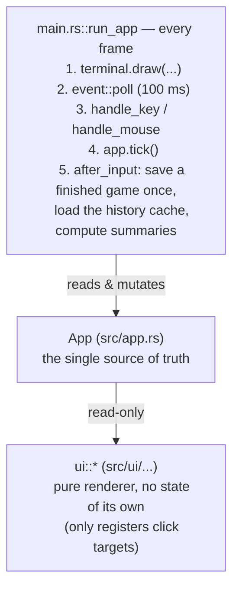
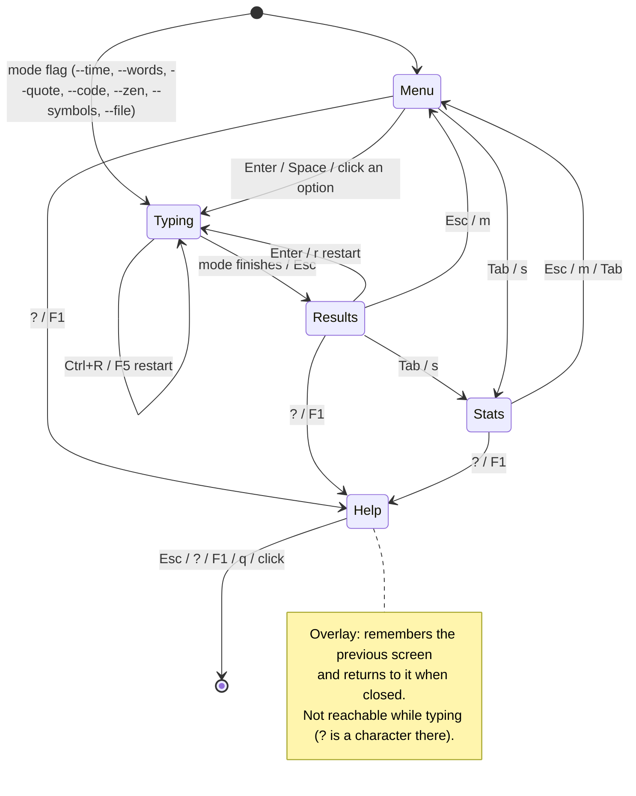
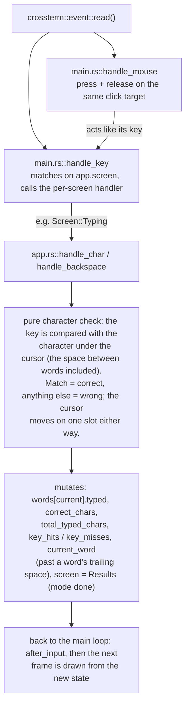

# TypeRush — Architecture

This is the map of the source tree. Read it before making non-trivial changes.

---

## Big picture

TypeRush is a single-process TUI app with one event loop, one mutable `App`
state object, and a stateless renderer. The flow per frame:

---

## State machine

The `Screen` enum in `src/app.rs` is the application's high-level state:

Every state transition happens by setting `app.screen` from a keymap handler in
`main.rs`.

---

## Data flow per keystroke

Mouse events take a short detour into the same path. While drawing, the UI
registers clickable regions in `App::click_targets` (menu options and footer
hints, rebuilt every frame). `main.rs::handle_mouse` looks up the region
under the pointer. A left-button press remembers that target
(`App::pressed_target`); the release fires its `ClickAction` only if it lands
on the same target: a footer hint calls `handle_key` with its key, a menu option
selects that option and presses Enter. Nothing is reachable by mouse that
isn't reachable by keyboard.

---

## Module responsibilities

```mermaid
flowchart LR
    src["src/"]
    src --> main["main.rs
    Entry point: terminal, event loop, panic hook,
    CLI parser (clap), key + mouse dispatch,
    after_input (save once, caches)"]
    src --> app["app.rs
    App state machine: all fields and transitions,
    WPM / accuracy math, mode switching, completion,
    per-key tracking, menu navigation, click targets"]
    src --> game["game.rs
    get_char_states(target, typed): the matcher
    behind all colored feedback"]
    src --> storage["storage.rs
    SessionRecord + ~/.typerush/stats.json (atomic writes).
    personal_best, personal_best_for_mode, average_accuracy,
    streak, avg_wpm_last_n_days, key_accuracy,
    bests_by_mode, StatsSummary, StatsView,
    ResultsComparison"]
    src --> state["state.rs
    ~/.typerush/state.json: the last custom file
    (atomic writes, path passed in)"]
    src --> text["text.rs
    printable / shorten: safe, width-aware display
    of user-supplied names, paths and file text"]
    src --> theme["theme/"]
    theme --> theme_mod["mod.rs
    ThemePalette (10 color slots) + per-slot overrides"]
    theme --> builtin["builtin.rs
    dark, light, monokai, dracula
    (new theme = one row in ALL)"]
    theme --> color["color.rs
    #RRGGBB and 16 ANSI color names parser"]
    src --> config["config/"]
    config --> config_mod["mod.rs
    Config / Defaults / Colors / Words from config.toml (serde)"]
    config --> load["load.rs
    load_or_default_with(CliOverrides): never errors,
    bad files become one human-readable warning;
    code_lang: one name table for
    code_lang and --code"]
    src --> ui["ui/"]
    ui --> ui_mod["mod.rs
    render() dispatcher, background paint,
    one clickable footer on the last row for every
    screen (each render returns its hints)"]
    ui --> menu["menu.rs
    title row, then one full-width box: banner on top,
    modes grouped by category, sized to fit (big or
    compact banner, category gaps all or none,
    then scrolling with more hints); word settings on
    the bottom border; long rows wrap"]
    ui --> typing["typing.rs
    header, progress gauge, words"]
    ui --> results["results.rs
    WPM delta, mode best, sparkline"]
    ui --> stats["stats.rs
    categories, summary, key heatmap, sparkline,
    scrolling sessions table (★ bests), bests table"]
    ui --> help["help.rs
    help overlay and error modal"]
    src --> words["words/"]
    words --> words_mod["mod.rs
    word source picker (random, quote, code, symbols, file);
    WordPool + WordDecor (punctuation / numbers)"]
    words --> english["english.rs
    ENGLISH_COMMON (~430 common words) and ENGLISH_10000"]
    words --> quotes["quotes.rs
    programming quotes + Rust / Python / JS /
    Go / Java / SQL / Shell snippets"]
    words --> symbols["symbols.rs
    programming-symbol tokens for Mode::Symbols"]
    words --> snippets["snippets.rs
    *.txt discovery in ~/.typerush/snippets/"]
```

---

## Key design choices

### Immediate-mode rendering
ratatui re-renders the whole UI every frame from `&App`. There is no retained
widget state. This makes reasoning about the UI trivial: whatever's in `App` is
what you see.

### Steady (no-blink) cursor
Earlier versions blinked a phantom `▏` character past the end of the typed
word. That toggled the rendered word width, shifting the whole line left/right
every 500ms. The current design renders a **steady** cursor as an
underlined character in `theme.accent`:

- on a character → the character itself, restyled with the cursor style
- on the space after a word → an underlined trailing space, same style

Both cases use the same `fg = theme.accent, modifier = UNDERLINED`. The
trailing space is always part of the layout, so toggling its style never
changes width.

### Theme-aware background paint
`ui::render` calls `frame.buffer_mut().set_style(area, ...)` with the
active theme's `background` color before any screen renders. This is what
makes the `light` theme actually look light on a dark terminal, and what
gives `monokai` / `dracula` their canonical backgrounds regardless of
terminal config. The `dark` theme uses `Color::Reset` so the user's
terminal background shines through exactly as it did in v0.1 — there is
no forced override.

Widgets that include plain `Line::from(string)` or `Cell::from(string)`
entries (no explicit fg) need a widget-level `.style(fg=theme.neutral)`
so they don't fall through to the terminal's default foreground — which
becomes invisible the moment the light theme paints a white background
over a dark terminal. The menu list, stats date column, and help overlay
all follow this pattern.

### Stats persistence
JSON, flat array, no schema. The file is small enough (one session ≈ 200B
before v0.3.0, slightly larger with per-key maps) that we rewrite it whole on
every save. Zen-mode sessions are deliberately excluded.

v0.3.0 added two optional fields to `SessionRecord`:
- `key_hits: HashMap<String, u64>` — per expected character, times typed correctly
- `key_misses: HashMap<String, u64>` — per expected character, times something
  else was typed instead (the space between words counts as a character)

Both fields use `#[serde(default)]` so old records without them load cleanly
as empty maps. The aggregation helpers (`streak`, `avg_wpm_last_n_days`,
`personal_best_for_mode`, `key_accuracy`) all live in `storage.rs` and are pure functions over
`&[SessionRecord]`.

### Read-path performance (v0.3.0)

The Stats and Results screens never touch disk on a frame (the render loop
redraws every 100 ms tick and on every input event, mouse motion included).

- **`App::stats_cache: Option<Vec<SessionRecord>>`** holds the full history.
  It's read from `stats.json` the first time the Stats or Results screen needs
  it. `storage::save_session_to_path` re-reads the file, appends, writes, and
  returns the updated list, which replaces the cache — so `stats.json` stays
  the single source of truth and an outside edit shows up after the next save.
- **`App::stats_view: Option<StatsView>`** (v0.4.1) — the Stats screen's
  category (all, bests, or one mode), the history indices of that
  category's sessions, its `StatsSummary` (PB, averages, streak, time typed,
  key accuracy), every mode's best (`bests_by_mode`) and the set of
  best-holding sessions for the ★. Built from the cache when the screen is
  entered (except when coming back from Help) and when the category
  changes; never per frame. The summary helpers take any iterator of
  `&SessionRecord`, so a category is summarised by reference. The list's
  scroll is a `Cell` so drawing can clamp it to the rows that fit.

All of this bookkeeping lives in `main.rs::after_input`, which also saves each
finished game exactly once: the "saved" flag is cleared only when a new game
starts, so visiting Help from Results can't save the session again.

### Custom files and `state.json` (v0.4.0)

The menu's `custom` row is built by `app::build_menu(snippets, last_file)`:
the last custom file first (skipped when it is one of the snippets), then each
snippet, or a single placeholder option when there is neither. Its labels come
from `app::custom_labels`, already terminal-safe and shortened, and all
distinct as drawn: snippets are labelled from the snippet set alone (so the
remembered file never changes them), the remembered file falls back to
`folder/name`, and repeats get the first free " (n)". `App::new`
never touches disk; `main.rs` discovers snippets and loads `state.json`, then
hands both to `App::load_custom_sources` together with the path to save to.
Tests leave that path `None`, so they can never write to a real home
directory.

Every custom start goes through `App::start_custom(path)`: it sets
`custom_file`, calls `start_game`, and only then saves the file to
`state.json` and the menu. If the file fails to load, `custom_file` is put
back, so neither a restart nor the remembered file ever points at the file
that failed. `start_game` builds the word list before changing any state, so
the screen, mode and words are untouched too. The saved path is made absolute
so it works from any directory.

`App::session_label` names a custom session after its file
(`custom-notes`), so each file has its own personal best; time and words
labels get the `+10k` / `+p` / `+n` suffixes of the word settings, which the
menu's `p` / `n` / `b` keys toggle on `App::word_pool` / `App::word_decor`.

### Config loading

`config::load::load_from(path, cli)` never fails: a missing file means
defaults, and an unreadable or unparseable one means defaults plus a warning
(shown in the error modal). Either way the CLI overrides (`--theme`, `--big`,
`--no-big`, `--punctuation`, …) are applied on top, so a typo in
`config.toml` never silently drops a flag.

### Cross-platform
crossterm handles Windows Console API, ANSI escape codes, and raw mode in one
crate. We don't directly use any platform-specific code, so the binary is a
"just build it" affair on any of Linux, macOS, Windows, or WSL.

### Error handling
- Setup / teardown errors propagate (`anyhow::Result`).
- A `panic::set_hook` resets the terminal before the panic message prints, so a
  crash never leaves the user's shell broken.
- Disk I/O for stats is best-effort — losing a record is never worth crashing.

---

## Performance notes

- Render loop runs at 10 fps (100ms tick). The actual `terminal.draw` cost is
  dominated by ratatui's diff algorithm — only changed cells are repainted.
- The typing screen lays out line numbers for every word (a character
  count each), then styles only the words on visible lines: the box scrolls
  so the cursor's line stays second from the top. A keystroke's redraw costs
  the same at word 10 and word 1000.
- `get_char_states` is O(n) in word length, walks both strings with
  iterators and is called once per visible word per frame.
- Time and zen runs keep 100 words ahead of the cursor (`App::top_up_words`)
  instead of generating a large list up front.

---

## When you add a new mode

1. Add a variant to `Mode` in `src/app.rs`.
2. Pattern-match it inside `App::start_game` to pick a word source.
3. Update `Mode::label` so it persists nicely in stats.
4. Add an entry to `build_menu()` — items sharing a `group` render under one
   heading, options side by side (wrapping when the row is too wide). New rows
   go after the existing ones so ↑/↓ through the old rows doesn't change.
5. If it has a unique completion condition, handle it in `advance_word()` /
   `tick()`.
6. (Optional) Add a CLI flag in `main.rs::Cli`.

## When you add a code language

1. Add a variant to `CodeLang` (`src/words/mod.rs`) and a snippet pool in
   `src/words/quotes.rs`; match it in `random_code_snippet`.
2. Add its names to `code_lang` in `src/config/load.rs` (this one table
   serves both `code_lang` in the config and `--code`).
3. Add a `start("code", …)` entry to `build_menu()`.

---

## When you add a new theme

1. Declare a `pub const` of type `ThemePalette` in `src/theme/builtin.rs`.
   Fill every slot (`accent`, `secondary`, `correct`, `incorrect`, `pending`,
   `mode_tag`, `error`, `neutral`, `background`). Every text color needs at
   least 4.5:1 contrast against the background, and `pending` (untyped text)
   must stay dimmer than `correct` and `neutral` — the
   `rgb_themes_meet_contrast_minimum` test checks both.
2. Append `("name", YOUR_THEME)` to `ALL` in the same file.
3. That's it. The CLI loader (`--theme <name>`), the config loader (`theme =
   "..."`), and `--list-themes` all iterate `ALL` — no other wiring needed.

If you want the theme to look identical regardless of terminal, set
`background` to a concrete `Color::Rgb(...)`. If you'd rather it inherit
the user's terminal background, set `background = Color::Reset`.
