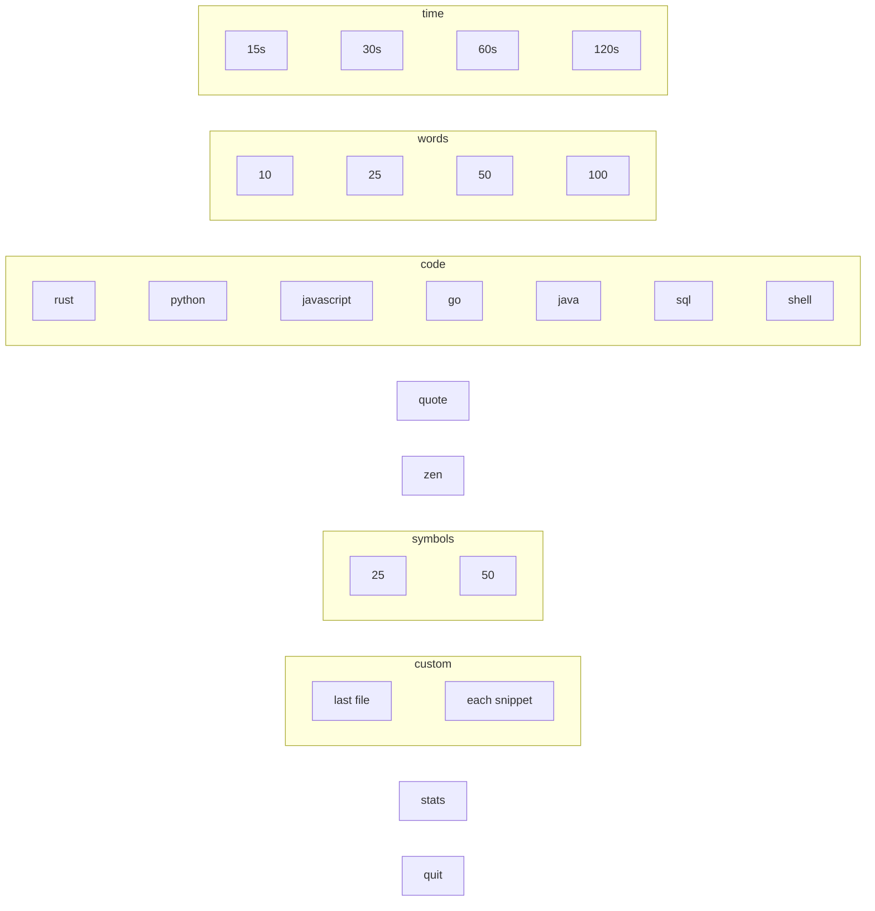
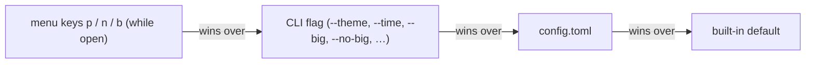

# TypeRush — Usage Guide

Everything you can do with TypeRush, in one place.

---

## Running it

Open the interactive menu:

```bash
typerush
```

Or skip the menu and start a session directly:

```bash
typerush --time 30            # 30-second timed test (15 / 30 / 60 / 120)
typerush --words 50           # type exactly N words
typerush --quote              # one programming quote
typerush --code rust          # code: rust | python | js | go | java | sql | shell
typerush --zen                # zen mode (no timer, no stats)
typerush --symbols 25         # programming-symbols drill of N tokens
typerush --file <path>        # type any text file you have
typerush --theme monokai      # one-shot theme override
typerush --list-themes        # print available theme names and exit
typerush --list-snippets      # print your snippets (name<TAB>path) and exit
```

Counts must be at least 1: `--time` goes up to 3600 seconds, `--words` and
`--symbols` up to 10,000. A custom file (`--file` or a snippet) must be a
regular text file of at most 1 MiB.

These switches make random words harder, and combine with any of the above
(they apply to time and words modes; zen always stays plain):

```bash
typerush --big                # 10,000-word pool instead of the ~430 common words
typerush --punctuation        # commas, periods, quotes, brackets on ~1 word in 4
typerush --numbers            # mix in 1–4 digit numbers (~1 word in 8)
typerush --no-punctuation     # off for this run, even if config.toml turns it on
```

Each has a `--no-` twin (`--no-big`, `--no-punctuation`, `--no-numbers`) for a
plain run when your config turns it on; if both are given, the last one wins.
In the menu, `p`, `n` and `b` toggle the same three settings (see
[Main menu](#main-menu)).

`--code` also accepts `rs`, `py`, `javascript`, `golang`, `sh` and `bash`.

### Your own text: `--file`, snippets, and the custom row

- `typerush --file notes.txt` starts typing that file straight away.
- Drop `.txt` files in `~/.typerush/snippets/` (on Windows,
  `%USERPROFILE%\.typerush\snippets\`) and each becomes an option in the
  menu's **custom** row, named after the file.
- The file you typed last — from `--file` or a snippet — is offered first in
  the custom row next time, so you don't need `--file` again. It is remembered
  in `~/.typerush/state.json` as an absolute path, and only once it has loaded.
- With no file and no snippets yet, the custom row shows `custom`; picking it
  explains how to add one.
- Each file keeps its own personal best: a session is saved as `custom-`
  plus the file name without its extension (`custom-notes` for `notes.txt`),
  so a five-word drill never sets the bar for a long essay.
- Every option in the row has a different label: long names are shortened in
  the middle (`quarterly-r…nal-draft-q1`), two snippets with the same name
  show their full file names, and a remembered file whose name a snippet
  already uses shows its folder too (`me/notes.txt`).

Text is split on whitespace, so a file's line breaks become plain spaces.

---

## Modes in detail

| Mode    | Description                                                          | Ends when…                       |
| ------- | -------------------------------------------------------------------- | -------------------------------- |
| Time    | Sprint — type as many words as possible in N seconds                  | the timer hits zero              |
| Words   | Type a fixed number of random words (10 / 25 / 50 / 100)              | you complete the last word       |
| Quote   | A randomly chosen famous programming quote                            | you complete the last word       |
| Code    | A real short code snippet (Rust, Python, JavaScript, Go, Java, SQL, Shell) | you complete the last word  |
| Zen     | Soft, monochrome UI. No timer, no WPM, no score saved.                | you press `Esc`                  |
| Symbols | Programming punctuation: `=>`, `(){};`, `&&`, `?.`, `<T>` … (25 / 50 tokens) | you complete the last token |
| Custom  | A text file: `--file`, a snippet, or the file you typed last          | you complete the last word       |

---

## Keybindings

### Everywhere

| Key          | Action                                                  |
| ------------ | ------------------------------------------------------- |
| `?` / `F1`   | Toggle keybindings overlay (not while typing)           |
| `Ctrl+C`     | Quit immediately                                        |

### Mouse

Everything the mouse can do, the keyboard can do too (WCAG 2.1.1), and vice
versa where it makes sense:

- **Click a menu option** to start it (or open stats / quit).
- **Click a footer hint** (`Enter start`, `s stats`, `esc finish`, …) to do
  what its key does. Navigation hints like `↑/↓ category` are not clickable.
- **Scroll wheel** on the menu moves between categories.
- **Click anywhere** to close the help overlay or an error message.

A click acts when the button is pressed *and* released on the same target:
press on the wrong option, slide off (or onto another option), and nothing
happens (WCAG 2.5.2).

Because TypeRush captures the mouse, selecting text in the terminal usually
needs `Shift` held while dragging.

### Main menu

Modes are grouped by category. `time`, `words`, `code`, `symbols` and
`custom` show a heading with their options on the line below (a row too wide
for the menu continues on the next line); `quote`, `zen`, `stats` and `quit`
are single options:



The bottom border of the list shows the three word settings — `p
punctuation`, `n numbers`, `b 10k words` — each spelled out as `on` or `off`
and clickable. They apply to time and words runs, whose saved label follows
them (`time-30s+p`).

The menu fits itself to the terminal. With room to spare it shows the big
banner and a blank line between categories. On a standard 80×24 terminal it
switches to a two-line banner and drops only as many of those blank lines as
it must, so every option is on screen at launch. Only on a terminal too short
for the whole list does it scroll, and then the border shows `▲ more` /
`▼ more`.


| Key                | Action                                         |
| ------------------ | ---------------------------------------------- |
| `↑ / ↓` or `j / k` | Previous / next category (keeps the column)    |
| `← / →` or `h / l` | Previous / next option in the category         |
| `Enter` / `Space`  | Start the selected mode                        |
| `p`                | Punctuation on / off (time and words runs)     |
| `n`                | Numbers on / off (time and words runs)         |
| `b`                | 10k-word pool on / off (time and words runs)   |
| `Tab` / `s`        | Jump to the historical stats view              |
| `q`                | Quit                                           |

### While typing

| Key              | Action                                          |
| ---------------- | ----------------------------------------------- |
| any printable    | Type that character                             |
| `Space`          | Type a space — correct only where the text has one |
| `Backspace`      | Delete the previous character                   |
| `Ctrl+Backspace` | Delete the entire current word (`Alt+Backspace` too) |
| `Ctrl+W`         | Same — delete the entire current word            |
| `Ctrl+H`         | Same — most terminals send this when you press `Ctrl+Backspace` |
| `Ctrl+R` / `F5`  | Restart the same mode with a new word list      |
| `Esc`            | End the session and go to the results screen    |

### Results screen

| Key             | Action                            |
| --------------- | --------------------------------- |
| `Enter` / `r`   | Restart the same mode             |
| `Tab` / `s`     | Open the stats history            |
| `m` / `Esc`     | Back to the menu                  |
| `q`             | Quit                              |

### Stats history

| Key                | Action            |
| ------------------ | ----------------- |
| `m` / `Esc` / `Tab`| Back to the menu  |
| `q`                | Quit              |

---

## How WPM is calculated

TypeRush uses the standard "5 characters = 1 word" formula:

```
wpm      = (correct_chars / 5) / minutes_elapsed
accuracy = (correct_chars / total_typed_chars) * 100
```

Only characters you typed **at the correct position** count as `correct_chars`.
Every character is checked on its own, and the space between words is a
character like any other. The key you press is compared with the character
under the cursor: a match is correct, anything else is wrong, and the cursor
moves on one slot either way. So a letter typed where a space belongs is a wrong
character (shown as a red underlined space), and a space typed mid-word is a
wrong character too — it does not jump to the next word. The run ends when the
last character is typed.

---

## Where your stats live

`~/.typerush/stats.json` — a plain JSON array. Back it up if you care about your
history; delete it if you want a fresh start.

Zen-mode sessions are intentionally **not** saved.

Everything TypeRush keeps lives in `~/.typerush/`:

| File / folder     | What it is                                                  |
| ----------------- | ----------------------------------------------------------- |
| `stats.json`      | Your session history                                        |
| `config.toml`     | Optional settings (see below)                               |
| `state.json`      | The custom file you typed last, so the menu can offer it again |
| `snippets/*.txt`  | Your snippet library — one menu option per file             |

Each file is written atomically, so a crash mid-save never leaves a broken file.

### What the Stats screen shows (v0.3.0+)

Open the Stats screen from the menu (`Tab`) or results screen (`s`).

| Section | What it shows |
| ------- | ------------- |
| **Summary (left)** | All-time best WPM · Average accuracy · Session count · Last WPM · **Daily streak** · **7-day avg WPM** · **30-day avg WPM** |
| **Key accuracy (right)** | Up to 5 of your worst keys (≥ 3 presses). Colour-coded: red < 80%, amber < 93%, green otherwise. Shows `no key data yet` until enough data is collected. |
| **WPM trend** | Sparkline of your last 20 sessions |
| **Recent sessions** | Last 10 sessions with date, mode, WPM, accuracy, and time |

### Per-mode personal bests

On the **Results screen**, the "best" line now shows your personal best
specifically for the mode you just finished (a `mode best` row under the `mode` row).
A `★ new best!` badge appears when you beat your previous record for that mode.
Time and words runs with `--big`, `--punctuation` or `--numbers` count as
their own modes (`time-30s+p`, …) — see [Words](#words).

---

## Configuration — `~/.typerush/config.toml`

The config file is **entirely optional**. Without it, TypeRush boots with the
`dark` theme and a 15-second time-mode pre-selected.

A complete example lives at [`config.example.toml`](../config.example.toml) at
the project root — copy it to `~/.typerush/config.toml` and edit.

### Themes

Pick a built-in palette by name:

```toml
theme = "monokai"
```

Built-in themes (run `typerush --list-themes` to print them):

| Name      | Style                                              |
| --------- | -------------------------------------------------- |
| `dark`    | Default — cyan / green / yellow on a dark terminal |
| `light`   | Softer palette for light-background terminals      |
| `monokai` | Classic Sublime/TextMate — pink/green/yellow       |
| `dracula` | Purple/pink/cyan on `#282a36`                      |

### Per-slot color overrides

Override any slot of the chosen theme:

```toml
theme = "dracula"

[colors]
accent = "#FF00FF"      # hex
correct = "green"       # or ANSI name
```

The 10 slots: `accent`, `secondary`, `correct`, `incorrect`, `pending`,
`extra`, `mode_tag`, `error`, `neutral`, `background`. Each maps to a
specific UI element — see `config.example.toml` for inline documentation.
`extra` is currently unused (typing can no longer run past the end of a word)
and is kept only so existing configs keep loading.

> **Background.** The `dark` theme uses `Color::Reset` for `background` so it
> picks up whatever your terminal's native background is — same look as v0.1.
> The `light`, `monokai`, and `dracula` themes paint their canonical
> backgrounds so the theme looks the same regardless of terminal. Set
> `background = "reset"` in `[colors]` if you'd rather one of those themes
> use your terminal background too.

### Defaults

Pre-select a menu row and starting mode:

```toml
[defaults]
mode = "time"            # time | words | quote | code | zen | symbols
time_seconds = 15        # 15 / 30 / 60 / 120 (matches menu rows)
word_count = 25          # 10 / 25 / 50 / 100
code_lang = "rust"       # rust | python | js | go | java | sql | shell
symbol_count = 25        # 25 / 50
```

### Words

Make random words harder (time and words modes; zen always stays plain):

```toml
[words]
pool = "extended"        # "common" (default, ~430 frequent words) | "extended" (10,000)
punctuation = true       # commas, periods, quotes, brackets on ~1 word in 4
numbers = true           # 1–4 digit numbers mixed in (~1 word in 8)
```

`--big`, `--punctuation` and `--numbers` turn these on for one run, and
`--no-big`, `--no-punctuation` and `--no-numbers` turn them off. In the menu,
`p`, `n` and `b` toggle them for as long as TypeRush stays open; the config
and the command line only set where they start. Your config file is never
rewritten.

Runs with any of these settings keep their own personal bests: the mode label
gets `+10k`, `+p` and/or `+n` (`time-30s+p`, `words-50+10k+p+n`), so a
harder run is only ever compared with runs played the same way.

### Precedence



A malformed config file does not crash TypeRush — it falls back to defaults
and shows one error modal you can dismiss with any key.

---

## Terminal compatibility

| Terminal        | Status   |
| --------------- | -------- |
| WSL (Ubuntu)    | ✅ Great |
| Windows CMD     | ✅ Works |
| PowerShell      | ✅ Great |
| macOS Terminal  | ✅ Works |
| iTerm2          | ✅ Great |
| Alacritty       | ✅ Great |
| Warp            | ✅ Great |

If colors look off on Linux/WSL, set:

```bash
export TERM=xterm-256color
export COLORTERM=truecolor
```
